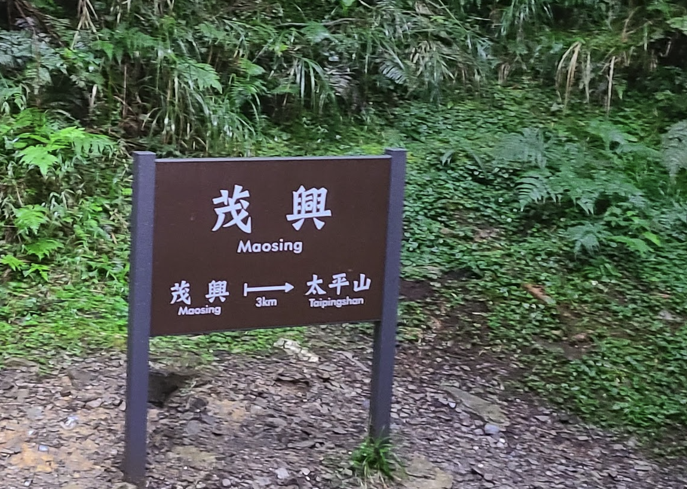

# 數位影像處理


## HW_1 透視變形校正 Perspective Distortion Correction


透視變形是指一般在拍攝影片、照片的時候，你可以看到一個物體及其周圍區域與標準鏡頭中看到的相比完全不同，由於遠近特徵的相對比例變化，發生了彎曲或變形。所以通常我們在自然背景拍攝一張照片時，或多或少都會有一些透視變形存在，而透視變形是由拍攝和觀看圖像的相對距離決定的，因為成像的視角也許會比觀看物體的視角更窄或是更廣，這樣看上去的相對距離就會與所期待的不一樣。

### 程式啟動說明

輸入一張圖，輸入x1,x2,x3,x4,y1,y2,y3,y4 八個點位做透視變形校正

參數

position1: `input_image_path`

position2: `x1,x2,x3,x4,y1,y2,y3,y4`


調用範例：
```
python perspective.py ./test/Perspective_4.png 258,247,650,633,271,555,261,534
```

### 程式說明


最主要是要解 `Ax=b`這個問題

#### 定義 Corner、Point
首先定義兩個class，表示四個角定位及x,y點位
1. Corner
2. Point

```python
class Corner:
    def __init__(self, r, c):
        self.r = r
        self.c = c

    def get_corner(self):
        return [Point(0, 0),
                Point(self.r - 1, 0),
                Point(0, self.c - 1),
                Point(self.r - 1, self.c - 1)]


class Point:
    def __init__(self, x, y):
        self.x = x
        self.y = y
```

#### 定義方法 init_A

傳入corner代表4角定位，傳入一個A矩陣進行初始化

```python
def init_A(A, corner, max_matrix):
    for i in range(max_matrix):
        if i < 4:
            A[i, 0] = corner[i].x
            A[i, 1] = corner[i].y
            A[i, 2] = corner[i].x * corner[i].y
            A[i, 3] = 1
        else:
            A[i, 4] = corner[i - 4].x
            A[i, 5] = corner[i - 4].y
            A[i, 6] = corner[i - 4].x * corner[i - 4].y
            A[i, 7] = 1
```

#### 定義方法 gauss_jordan

這個方法主要是用高斯消去法解出 b 裡面的八個參數

```python
def gauss_jordan(A, b):
    """
    高斯消去法
    :return: b
    """
    i, j, k, s = 0, 0, 0, 0

    # l = np.zeros((MAX_MATRIX, MAX_MATRIX), dtype=np.float64)
    max_matrix = A.shape[0]
    l = np.zeros((max_matrix, max_matrix), dtype=np.float64)

    for k in range(max_matrix - 1):
        s = k
        r = fabs(A[k, k])

        for i in range(k, max_matrix):
            if r < fabs(A[i, k]):
                r = fabs(A[i, k])
                s = i
        if s != k:
            A[[k, s]] = A[[s, k]]  # 交換 k row 和 s row
            b[k], b[s] = b[s], b[k]

        for i in range(k + 1, max_matrix):
            l[i, k] = A[i, k] / A[k, k]

            for j in range(k, max_matrix):
                A[i, j] = A[i, j] - l[i, k] * A[k, j]
            b[i] = b[i] - l[i, k] * b[k]

    if A[k, k] < 0.0001:
        print("Error!Can not find the solution!")
        exit(1)

    for i in range(max_matrix - 1, -1, -1):
        u = 0
        for j in range(i + 1, max_matrix):
            u = u + A[i, j] * b[j]
        b[i] = (b[i] - u) / A[i, i]

    return b
```

#### 定義方法 invert_mapping

這個方法主要傳入八個參數及原圖及輸出圖，代公代並採用invert mapping進行最後輸出

```python
def invert_mapping(b, input_img, output_img):
    rows = output_img.shape[0]
    cols = output_img.shape[1]

    for i in range(rows):
        for j in range(cols):
            double_y = ((b[0] * i) + (b[1] * j) + (b[2] * i * j) + b[3])
            double_x = ((b[4] * i) + (b[5] * j) + (b[6] * i * j) + b[7])
            y = int(double_y)
            x = int(double_x)
            v = (double_y - y)
            u = (double_x - x)
            for c in range(3):
                # f(x,y) = (1-u)(1-v)g(x,y) + u(1-v)g(x,y+1) + v(1-u)g(x+1,y) + uvg(x+1,y+1)
                output_img[i, j, c] = (1 - u) * (1 - v) * input_img[x, y][c] + \
                                      u * (1 - v) * input_img[x, y + 1][c] + \
                                      v * (1 - u) * input_img[x + 1, y][c] + \
                                      u * v * input_img[x + 1, y + 1][c]
```

#### 主程式說明

1. 取得輸出圖片`out_x`、`out_y`產生`output_img`
2. 調用`init_A`組裝出`Ax=b`相關必要參數
3. 調用`gauss_jordan`求出八個參數
4. 最後調用`invert_mapping`得出輸出圖

```python
def main():
    img_path = sys.argv[1]
    input_img = cv2.imread(img_path)
    max_matrix = 8

    # b = [404, 275, 3376, 3520, 1077, 1636, 1198, 1674]  #Perspective_2.jpg
    # b = [66, 54, 1092, 1100, 174, 904, 61, 948]  #Perspective_3.jpg
    # x1,x2,x3,x4,y1,y2,y3,y4
    b = [int(b) for b in sys.argv[2].split(',')]
    A = np.zeros((max_matrix, max_matrix), dtype=np.float64)

    out_x = abs(b[3] - b[0])
    out_y = abs(b[4] - b[5])
    output_img = np.zeros((out_y, out_x, 3), dtype=input_img.dtype)  # Perspective_3.jpg

    rows = output_img.shape[0]
    cols = output_img.shape[1]
    corner = Corner(rows, cols).get_corner()

    init_A(A, corner, max_matrix)
    b = gauss_jordan(A, b)

    [print(f'b[{i}]={b[i]}') for i in range(max_matrix)]

    invert_mapping(b, input_img, output_img)

    cv2.imshow("Perspective_source", input_img)
    cv2.imshow("Perspective_process", output_img)
    # 隨意Key一鍵結束程式
    cv2.waitKey(0)
    cv2.destroyAllWindows()
```

### 執行結果




### 結論
譔寫高斯消去法求八個參數是這個作業我遇到最大的難題，尋找許多資料及參考公式才兜出來，完成HW1以後覺的很有成就感。

後續試了許多照片，一開始比例都會跑掉，所以又想了一個算法自動去計算寬高使它可以自動計算比例

如今它已經被我整理完放上github成為我的工具類，後續還會研發更多的影像處理算法。

## HW_2 非銳化濾鏡 Unsharp Masking


**銳化**指的是增強原始影像中的某一些細節(detail)，透過設計一個Mask 把它罩在影像的邊緣上 ，然後針對邊緣的部分做sharpening 的動作，其餘的不是邊緣的地方我們就把它給略過，進而避免把平坦區的雜訊放大。

### 程式啟動說明
參數

position1: `input_image_path`

position2: `threshold 閥值`


調用範例：
```
python unsharp.py ./test/Lena_2.png 128
```

### 程式說明


一張原始影像(Source Image)進來，我們對它做 Unsharp Mashing，步驟如下：
1. 程式載入一張原始影像，若為"彩色影像"則將它轉成"灰階影像"，得 `gray_img`
2. 對 `gray_img` 做 Sobel Operator，會得到一張一階維分的 `diff_1_img`
3. 對 `gray_img` 做 Laplace Operator ，會得到一張二階維分的 `diff_2_img`
4. 對 `diff_1_img` 做 算術平均濾波(Mean Filter)，得到 `mean_img`
5. 將 `diff_2_img` 與`mean_img` 做相乘的動作，得到我們真正要 Enhance 的數值 `e`
6. 用 `e` 對 原始影像(Source Image) 做 Enhancement，得到 Unsharp Masking 結果

#### 定義 Class： UnsharpService

該類封裝了`mean`、`sobel`、`laplace`等mask結構，封裝了`convolution` 並提供以下主要功能
1. get_diff_1：傳入一張圖片，調用`sobel x mask`、`sobel y mask`，回傳一階微分後的結果
2. get_diff_2：傳入一張圖片，調用`laplace mask` 回傳二階微分後的結果
3. mean_filter：傳入一張圖片，調用`mean_mask` 並回傳結果
4. enhancement：傳入原圖、二階微分圖、平均濾波圖 回傳 `Unsharp Masking`的結果

```python
class ConvolutionType(Enum):
    MeanFilter = 1
    Sobel_X = 2
    Sobel_Y = 3
    Laplace = 4


class UnsharpService:
    def __init__(self, threshold):
        self.__threshold = threshold

        self.__mean_mask = [1, 1, 1,
                            1, 1, 1,
                            1, 1, 1]

        self.__sobel_x_mask = [-1, 0, 1,
                               -2, 0, 2,
                               -1, 0, 1]

        self.__sobel_y_mask = [-1, -2, -1,
                               0, 0, 0,
                               1, 2, 1]

        self.__laplace_mask = [-1, -1, -1,
                               -1, 8, -1,
                               -1, -1, -1]

    def mean_filter(self, img):
        """
        算術平均濾波
        :param img:
        :return:
        """
        rows = img.shape[0]
        cols = img.shape[1]
        mean_img = np.zeros((rows, cols), dtype=img.dtype)
        self.__convolution(img, mean_img, self.__mean_mask, ConvolutionType.MeanFilter)
        return mean_img

    def __sobel_y(self, src, out):
        self.__convolution(src, out, self.__sobel_y_mask, ConvolutionType.Sobel_Y)

    def __sobel_x(self, src, out):
        self.__convolution(src, out, self.__sobel_x_mask, ConvolutionType.Sobel_X)

    def get_diff_1(self, img):
        """
        一階微分
        :param img:
        :return:
        """
        rows = img.shape[0]
        cols = img.shape[1]
        sobel_y_img = np.zeros((rows, cols), dtype=img.dtype)
        sobel_x_img = np.zeros((rows, cols), dtype=img.dtype)
        diff_1_img = np.zeros((rows, cols), dtype=img.dtype)

        self.__sobel_y(img, sobel_y_img)  # sobel y
        self.__sobel_x(img, sobel_x_img)  # sobel x

        for i in range(1, rows - 1):
            for j in range(1, cols - 1):
                # print(f"a,b={diff_1_img[i, j]},{diff_2_img[i, j]}")
                sobel = int(sobel_x_img[i, j]) + int(sobel_y_img[i, j])
                # if sobel > 255:
                #     print(sobel)
                # print(f"i,j={i},{j}")
                diff_1_img[i, j] = self.__chk_val(sobel)
        return diff_1_img

    def get_diff_2(self, img):
        """
        二階微分
        :param img:
        :return:
        """
        rows = img.shape[0]
        cols = img.shape[1]

        diff_2_img = np.zeros((rows, cols), dtype=img.dtype)
        self.__laplace(img, diff_2_img)

        return diff_2_img

    def __laplace(self, src, out):
        self.__convolution(src, out, self.__laplace_mask, ConvolutionType.Laplace)

    def __convolution(self, src, out, mask, conv_type):
        rows = out.shape[0]
        cols = out.shape[1]

        for i in range(1, rows - 1):
            for j in range(1, cols - 1):
                conv = mask[0] * src[i - 1, j - 1] + \
                       mask[1] * src[i - 1, j] + \
                       mask[2] * src[i - 1, j + 1] + \
                       mask[3] * src[i, j - 1] + \
                       mask[4] * src[i, j] + \
                       mask[5] * src[i, j + 1] + \
                       mask[6] * src[i + 1, j - 1] + \
                       mask[7] * src[i + 1, j] + \
                       mask[8] * src[i + 1, j + 1]

                if conv_type == ConvolutionType.MeanFilter:
                    conv = conv / 9
                    conv = 255 if conv > self.__threshold else 0
                elif conv_type == ConvolutionType.Sobel_X or conv_type == ConvolutionType.Sobel_Y:
                    conv = sqrt(pow(conv, 2))

                out[i, j] = self.__chk_val(conv)

    def enhancement(self, src, diff_2_img, mean_img):
        for i in range(1, diff_2_img.shape[0] - 1):
            for j in range(diff_2_img.shape[1] - 1):
                for c in range(3):
                    # 求得 Enhance 的數值 `e`
                    src[i, j, c] = self.__chk_val(src[i, j, c] + (diff_2_img[i, j] * (mean_img[i, j] / 255))) 
        return src

    @staticmethod
    def __chk_val(v):
        if v > 255:
            return 255
        if v < 0:
            return 0
        return v
```
#### 主程式說明

1. 取得原圖(input_img)並進行灰階處理得到：`gray_img`
2. 調用UnsharpService.get_diff_1 進行一階微分得：`diff_1_img`
3. 調用UnsharpService.get_diff_2 進行二階微分得：`diff_2_img`
4. 調用UnsharpService.mean_filter 進行平均濾波得：`mean_img`
4. 調用UnsharpService.enhancement 得：`enha_img`，此為**非銳化濾波 Unsharp Masking**的結果

```python
def main():
    img_path = sys.argv[1]
    threshold = int(sys.argv[2])
    input_img = cv2.imread(img_path)
    cv2.imshow("Unsharp_source", input_img)

    gray_img = cv2.cvtColor(input_img, cv2.COLOR_BGR2GRAY)

    service = UnsharpService(threshold=threshold)
    diff_1_img = service.get_diff_1(gray_img)
    diff_2_img = service.get_diff_2(gray_img)
    mean_img = service.mean_filter(diff_1_img)  # unsharp mask

    enha_img = service.enhancement(input_img, diff_2_img, mean_img)

    cv2.imshow("Unsharp_diff_1_img", diff_1_img)  # sobel
    cv2.imshow("Unsharp_mean_img", mean_img)  # mean sobel
    cv2.imshow("Unsharp_diff_2_img", diff_2_img)  # laplac
    cv2.imshow("Unsharp_UnsharpMasking", enha_img)

    # 隨意Key一鍵結束程式
    cv2.waitKey(0)
    cv2.destroyAllWindows()
```

### 執行結果


### 結論
非銳化濾鏡 Unsharp Masking 這個作業讓我了解到直接做一些的Unsharp會導致雜訊問題。當中遇到最大的問題是convolution的實作，兩個迴圈的走訪會有點混亂，進行完convolution還要做MeanFilter、laplace也遇到許多問題

後續開始研究一階微分、二分微分、邊緣偵測這些sobel運算、以及Laplace Operator還有平均濾波

這些組合起來竟然可以做到  Unsharp Masking，令我嘆為觀止，學到寶貴一課。

## HW_3_1 邊界抽取 Boundary Extraction

參數

position1: `input_image_path`

position2: `element_size`


調用範例：
```
python boundary.py ./test/staff.png 3
```

執行結果


## HW_3_2 區域填充 Region Filling

參數

position1: `input_image_path`

position2: `element_size`


調用範例：
```
python regionfilling.py ./test/RegionFilling.png 3
```

執行結果


## HW_4 Use a CNN-based neural network to classify the scene is indoors or outdoors
訓練「CNN」模型進行影像二元分類，本次作業為對`室內`及`室外`進行分類


Colab：
https://colab.research.google.com/drive/1UE25OtvfwhRnKFtZMSScqw3hw4iD3vgd#scrollTo=2RZiZHyiAZsW

Dataset：

https://drive.google.com/file/d/1EmDy1ceebJKtQUZ0heZqy2y3iimxVXan/view?usp=sharing

訓練結果：

Test Loss: 0.486845
Test Accuracy: 81% (65/80)

### 程式說明
#### Initialize

先`Initialize`，進行初始化及載入必要組件，包含`pytorch`、`sklearn`、`tqdm`及連接 google drive

#### Load Data & Show Images

載入資料並show 出圖片確認資料集


#### Define CNN Model

定義 CNN model

``` python
class CNN_Model(nn.Module):
    def __init__(self):
        super(CNN_Model, self).__init__()

        # Convolution 1 , input_shape=(3,224,224)
        self.cnn1 = nn.Conv2d(in_channels=3, out_channels=16, kernel_size=5, stride=1, padding=0) #output_shape=(16,220,220) #(224-5+1)/1 #(weigh-kernel+1)/stride 無條件進位
        self.relu1 = nn.ReLU() # 採用ReLU 激勵函數

        # Max pool 1
        self.maxpool1 = nn.MaxPool2d(kernel_size=2) #output_shape=(16,110,110) #(220/2)
        # Convolution 2
        self.cnn2 = nn.Conv2d(in_channels=16, out_channels=32, kernel_size=5, stride=1, padding=0) #output_shape=(32,106,106)
        self.relu2 = nn.ReLU() 

        # Max pool 2
        self.maxpool2 = nn.MaxPool2d(kernel_size=2) #output_shape=(32,53,53)        
        # Convolution 3
        self.cnn3 = nn.Conv2d(in_channels=32, out_channels=16, kernel_size=3, stride=1, padding=0) #output_shape=(16,51,51)
        self.relu3 = nn.ReLU()

        # Max pool 3
        self.maxpool3 = nn.MaxPool2d(kernel_size=2) #output_shape=(16,25,25)
        # Convolution 4
        self.cnn4 = nn.Conv2d(in_channels=16, out_channels=8, kernel_size=3, stride=1, padding=0) #output_shape=(8,23,23)
        self.relu4 = nn.ReLU()

        # Max pool 4
        self.maxpool4 = nn.MaxPool2d(kernel_size=2) #output_shape=(8,11,11)
        # Fully connected 1 ,#input_shape=(8*12*12)
        self.fc1 = nn.Linear(8 * 11 * 11, 512) 
        self.relu5 = nn.ReLU()
        self.fc2 = nn.Linear(512, 2) 
        self.output = nn.Softmax(dim=1)
        
    
    def forward(self, x):
        out = self.cnn1(x) # Convolution 1
        out = self.relu1(out)
        out = self.maxpool1(out)# Max pool 1

        out = self.cnn2(out) # Convolution 2
        out = self.relu2(out) 
        out = self.maxpool2(out) # Max pool 2

        out = self.cnn3(out) # Convolution 3
        out = self.relu3(out)
        out = self.maxpool3(out) # Max pool 3

        out = self.cnn4(out) # Convolution 4
        out = self.relu4(out)
        out = self.maxpool4(out) # Max pool 4
        
        out = out.view(out.size(0), -1) # last CNN faltten con. Linear NN
        out = self.fc1(out) # Linear function (readout)
        out = self.fc2(out)
        out = self.output(out)

        return out
```

#### Train & Validate Model

epoch：設定5
lr設定：0.001
batchSize：32
criterion：CrossEntropyLoss
optimizer：Adam

```python
criterion = nn.CrossEntropyLoss()
optimizer = torch.optim.Adam(model.parameters(), lr = LR) # 使用Adam優化器
epoch = 5

valid_loss_min = np.Inf # track change in validation loss

for epoch in range(1, epoch + 1):

    # keep track of training and validation loss
    train_loss = 0.0
    valid_loss = 0.0
    print('running epoch: {}'.format(epoch))
    
    # enable train mode
    model.train()
    for data, target in tqdm(train_loader):        
        if device:
            data, target = data.cuda(), target.cuda()
        
        optimizer.zero_grad() # 梯度歸零
        output = model(data)        
        loss = criterion(output, target) # 計算 loss
        loss.backward() # 反向傳播
        optimizer.step()
        train_loss += loss.item()*data.size(0) # 更新 loss
        
    # enable validate mode 
    model.eval()
    for data, target in tqdm(valid_loader):
        if device:
            data, target = data.cuda(), target.cuda()

        output = model(data)        
        loss = criterion(output, target)# 計算 loss
        valid_loss += loss.item()*data.size(0)# 更新 loss
    
    # 計算平均Loss   
    train_loss = train_loss/len(train_loader.dataset)
    valid_loss = valid_loss/len(valid_loader.dataset)
        
    print('Training Loss: {:.6f} Validation Loss: {:.6f}'.format(train_loss, valid_loss))
    
    # save model
    if valid_loss <= valid_loss_min:
        print('Validation loss decreased ({:.6f} --> {:.6f}).  Saving model ...'.format(
        valid_loss_min,
        valid_loss))
        torch.save(model.state_dict(), 'model_CNN.pth')
        valid_loss_min = valid_loss
```

#### Train Result


#### Test Model


```python
def test(loaders, model, criterion):

    test_loss = 0.
    correct = 0.
    total = 0.

    model.eval()
    for batch_idx, (data, target) in enumerate(loaders): 
        if device:
            data, target = data.cuda(), target.cuda()

        output = model(data)
        loss = criterion(output, target) #計算 loss
        test_loss = test_loss + ((1 / (batch_idx + 1)) * (loss.data - test_loss))

        # 轉成預測分類
        pred = output.data.max(1, keepdim=True)[1]
        # 與真實分類做比較
        correct += np.sum(np.squeeze(pred.eq(target.data.view_as(pred))).cpu().numpy())
        total += data.size(0)
            
    print('Test Loss: {:.6f}'.format(test_loss))

    print('Test Accuracy: %2d%% (%2d/%2d)' % (100. * correct / total, correct, total))
```

### 結論
因為本身主修NLP，用到的模型都是`RNN`、`LSTM`、`GRU`等等，較少接觸圖型識別這一塊，還特別去研究了CNN模型的搭建及Train的方式。
經過了這次學習使用CNN識別室內、室外這個Project，發現其實模型的搭建都是大同小異，好像Train一個圖型Model也沒有想像中那麼難了
後續也會開始嘗試 Kaggle上面其它跟圖型有關的任務，累積更多圖型識別的經驗。